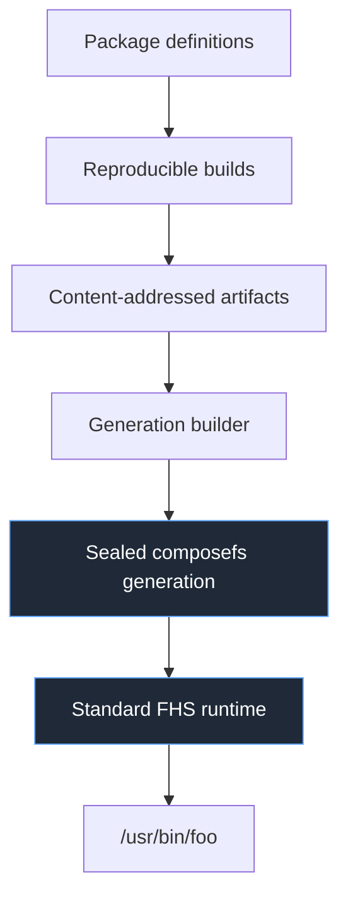
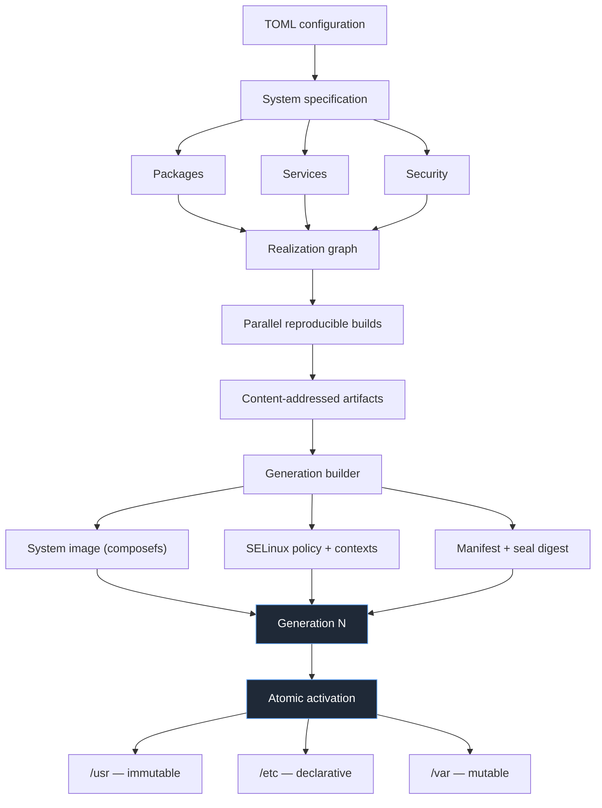
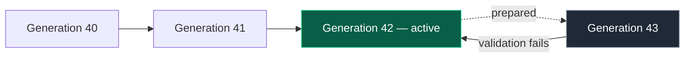

  

---

**A declarative Linux distribution via NixOS-style reproducibility with a standard FHS layout, first-class SELinux, and TOML configuration.**

| Build Status | Latest Stable Release |
|--------------|-----------------------|
|  |  |

---

## ⚠️ Project status

**Early development — not yet pre-alpha.** No releases or ISOs. APIs and formats will change. Do not use this as a production operating system.

## Further reading

For the full architectural design including package identity, build scheduling, the store layout, the generation and security models, `nexis-init`, and the roadmap please refer to.

[main repo](https://github.com/NexisOS/nexisos)

---

## What NexisOS is

NexisOS is a free and open-source Linux distribution focused on **transparency, control, reproducibility, security, and system integrity** through declarative system configuration.

It is inspired by NixOS, but takes a different position on the relationship between package management and the Linux runtime filesystem.

- Custom declarative package manager
- Custom init system (`nexis-init`)
- Schema-validated TOML configuration
- Content-addressed package artifacts
- Sealed composefs system generations
- A standard FHS-compatible runtime filesystem
- SELinux as a first-class security mechanism
- Atomic activation and rollback

---

## The core idea

Systems that achieve reproducible builds and immutable state usually give up conventional filesystem semantics and mandatory access control. The reason is a single choice: **exposing content-addressed store paths as the runtime interface.**

That one decision is why prebuilt binaries need patching, why the dynamic linker needs `RPATH` and wrapper scripts, and why path-based SELinux policy cannot address anything meaningfully.

NexisOS therefore separates the **package store** from the **runtime filesystem**. The store holds immutable artifacts; applications never execute from it. The generation builder resolves the full runtime closure while composing the system image, so applications see `/usr/bin/foo`, not `/store/<hash>/bin/foo`.

Two consequences follow directly:

- **Prebuilt Linux binaries run unmodified.** A vendor tarball, AppImage, or `.deb` payload finds `/lib64/ld-linux-x86-64.so.2` where it expects it.
- **Upstream SELinux `refpolicy` file contexts apply nearly unchanged**, because paths are stable and meaningful.

## Diagram — from definition to running system

click to see

---

## Design principles

| Principle | Meaning |
| --- | --- |
| **Declarative** | System state is defined through schema-validated TOML |
| **Reproducible** | Builds derive strictly from declared and verified inputs |
| **Content-addressed** | Artifacts are identified by content, not install path |
| **Immutable runtime** | The base system is a sealed filesystem generation |
| **Atomic** | Changes are prepared, validated, and activated whole |
| **Rollback by design** | Previous generations remain available |
| **Standard-compatible** | The runtime is a conventional FHS layout |
| **Secure by construction** | SELinux, seccomp, namespaces, capabilities, cgroups are part of the system model |
| **Decentralized** | No single authoritative definition repository |
| **Dendritic** | Configuration composes from reusable modules and profiles |

---

## Compared with NixOS

| Area | NixOS | NexisOS |
| --- | --- | --- |
| Configuration | Nix language | Schema-validated TOML |
| Runtime layout | Store paths are part of runtime composition | Standard FHS-compatible generation |
| Composition | Symlink farm | Mounted composefs image |
| Prebuilt binaries | Require `patchelf` / `nix-ld` / FHS wrappers | Run unmodified |
| SELinux | Difficult to integrate with store paths | First-class design goal |
| Init system | systemd | Custom `nexis-init` |
| Deduplication | Retroactive hardlinking (`--optimise`) | Content-addressed at insert; no optimise step exists |
| Garbage collection | Reachability walk, `/proc` scan, `rm -rf` | Refcounted index; cost tracks what is retired |
| Dependency resolution | Exact references | Ordered pinned sources; selection, not solving |
| Repository model | Central ecosystem with decentralized overlays | Decentralized definitions and optional caches |

## Diagram system architecture

click to see

## Diagram activation and rollback

click to see

A generation carries its filesystem, service configuration, security policy, metadata, and boot configuration together — so a rollback cannot restore the filesystem while leaving an incompatible policy behind.

---

## There is no imperative install

There is no `nexis install`. `nix-env` is precisely the escape hatch that lets a declarative machine stop describing itself, and its existence means a system can be in a state its configuration does not produce.

Removing it is necessary but not sufficient, because friction routes around itself. So `nexis install firefox` does not error — it prints the file and table the package belongs in and offers `nexis add firefox`, which **edits the declaration and then rebuilds**.

The invariant is not "the user must type TOML by hand"; it is that system state is a pure function of the declaration.

# NexisOS Organization Community Files

1. [DISCLAIMER.md](DISCLAIMER.md) - Legal and compliance information, including user responsibilities and jurisdiction warnings.
2. [PRIVACY.md](PRIVACY.md) - Privacy policy detailing data handling and user data responsibilities.
3. [CODE_OF_CONDUCT.md](CODE_OF_CONDUCT.md) - Guidelines for community behavior and interaction.
4. [CONTRIBUTING.md](CONTRIBUTING.md) - Instructions for contributing to NexisOS projects.
5. [SECURITY.md](SECURITY.md) - Reporting security vulnerabilities and responsible disclosure.
6. [PULL_REQUEST_TEMPLATE.md](PULL_REQUEST_TEMPLATE.md) - Template for submitting pull requests.
7. [GOVERNANCE.md](GOVERNANCE.md) - Overview of project governance structure.
8. [AI_Policy.md](GOVERNANCE.md) - Discuses proper use of AI-assisted design.

---

## Community, contact, license

Use **GitHub Issues** for discussion, bug reports, and feedback.

**Email:** [kyle.gortych.dev@gmail.com](mailto:kyle.gortych.dev@gmail.com) please prefer Issues where possible; as the sole maintainer, response times vary.

Licensed under the **GNU General Public License v3.0**. Provided "as is", without warranty of any kind.

NexisOS is an independent project. It does **not** collect user data, provides no hosted services, and is not affiliated with the Linux Foundation, the NixOS Foundation, or other organizations referenced in its documentation.
